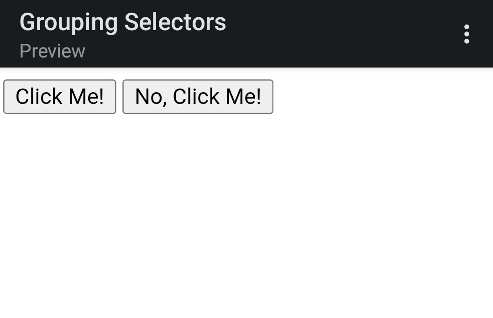

# Grouping Selectors

In this exercise I'm going to give two elements each a unique class name, then add rules for styles that both elements share as well as their own unique styles.

The properties added to each element are:

* **The first element**: a black background and white text
* **The second element**: a yellow background
* **Both elements**: a font size of 28px and a list of fonts containing `Helvetica` and `Times New Roman`, with `sans-serif` as a fallback 

## Initial

## Desired Outcome

